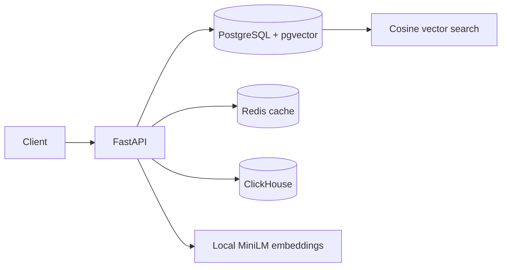

# HTAP Security Log Analyzer

Hybrid transactional/analytical security log analyzer with PostgreSQL + pgvector, Redis, ClickHouse, and local Hugging Face embeddings.



## Run

```powershell
docker compose up -d
python -m venv .venv
.\.venv\Scripts\Activate.ps1
pip install -r requirements.txt
uvicorn app.main:app --reload
```

Open http://localhost:8000/docs. The first embedding request downloads `all-MiniLM-L6-v2` from Hugging Face and then runs locally.

Services: PostgreSQL/pgvector at `5432`, Redis at `6379`, ClickHouse HTTP at `8123`.
